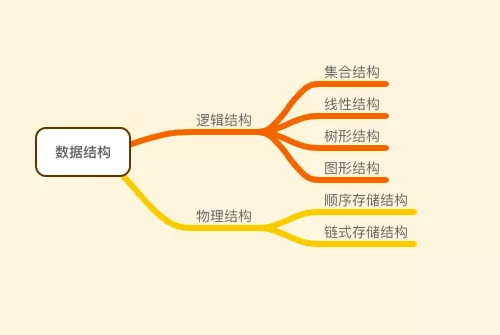
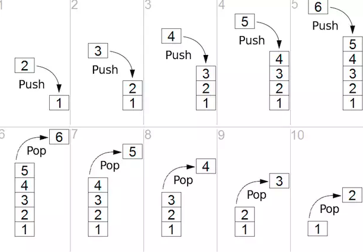

# DataStructure-Swift
## 前言
通过使用swift实现数据结构和算法来巩固相关知识
## 数据结构
> 数据结构：是相互之间存在一种或多种特定关系的数据元素集合

数据结构的重点是在于结构和关系，其关键是数据之间如何联系起来的

数据之间的联系可以从两个纬度来说：
1. 逻辑结构：指数据对象中元素之间的相互联系
2. 物理结构：指数据的逻辑结构在计算机中的存储形式

物理结构是数据实际在计算机内存中的存储联系，逻辑结构则是抽象联系

逻辑结构又可以有以下分类：
1. 集合结构：集合结构中的数据元素除了同属于一个集合外，它们之间没有其他联系
2. 线性结构：线性结构中的数据元素之间是一对一的关系
3. 树形结构：数据结构中的元素存在一对多的相互关系
4. 图形结构：数据结构中的元素存在多对多的相互关系

物理结构：
1. 顺序存储结构：把数据元素存放在抵制连续的存储单元里，其数据间的逻辑关系和物理关系是一致的（数组）
2. 链式存储结构：把数据元素存放在任意的存储单元中，这些存储单元可以是连续的，也可以是不连续的

通过结合这两个纬度的结构结合，我们可以定义出来实际的数据结构实现：
* 顺序储存结构和线性结构结合就是数组：它在内存中分布是连续的，元素间可以通过内存地址坐关联
* 链式存储结构和线性表就是链表：它的内存分布可以是不连续的，元素之间通过指针来做关联：
  * 如果每个元素（在链表中称为节点）只持有指向后门节点的指针，则为单链表
  * 如果每个元素（在链表中称为节点）持有指向前后节点的两个指针，则为双链表

### 抽象数据类型
>抽象数据类型（Abstract Data Type ： ADT）：是一个数学模型及定义在该模型上的一组操作。

抽象数据类型的定义仅仅取决于它的一组逻辑特性，而与其在计算机内部如何表示和实现没有关系。而且，抽象数据类型不仅仅指那些已经定义并实现的数据类型，还包括程序员自己定义的数据类型。

数据类型的标准格式：

    ADT 抽象数据类型名

    Data
      数据元素之间逻辑关系的定义

    Opeation
      操作1
        初始条件
        操作结果描述

      操作2
        初始条件
        操作结果描述

      操作n

    endADT

### 链表、栈和队列

#### 链表
线性表的定义
> 线性表：零或多个数据元素的有限序列

线性表根据物理结构的不同，有两种具体的实现方式：
* 线性表的顺序储存结构：即顺序表，线性表的数据元素是一段地址连续的存储单元存储起来
* 线性表的链式存储结构：即链式表，线性表的数据元素是被一组连续或不连续的存储单元存储起来，这些元素通过指针作为逻辑上的链接。

线性表的实现就是数组，链式表的实现则为链表

##### 链表定义
> 链表是一种物理存储单元上非连续、非顺序的存储结构，数据原属的逻辑顺序是通过链表中的指针链接次序实现的。

而且由于数据元素所持有的指针个数和链接特性可以将链表分为：
* 单向链表：单向链表的链接方向是单向的，其中每个节点都有指针成员变量指向链表中的下一个结点。
* 双向链表：双向链表的每个数据结点中都有两个指针，分别指向直接后继和直接前驱。所以，从链表中的任意一个结点开始，都可以很方便的访问他的前驱结点和后继结点，它的链接方向是双向的。
* 循环链表：循环链表是另一种形式的链式存贮结构，它的特点是表中的最后一个结点的指针指向头结点，整个链表形成一个环。
    ADT 节点（node）

    Data
      Value：持有的数据

    Operation
      init:初始化
      previous:指向上一节点的指针
      next:指向下一个节点的指针
    endADT

链表的抽象数据类型
    ADT 链表（linked list）

    Data
      linked list：持有的线性表

    Operation
      init:初始化
      count:持有的节点总个数
      isEmpty:是否为空
      first：头节点
      last：尾节点
      node：传入index返回节点
      insert：插入node到指定的index
      insertToHead：插入节点到表头
      appendToTail：插入节点到表尾
      removeAll：移除所有节点
      remove：移除传入节点
      removeAt：移除传入Index的节点

    endADT

#### 栈
##### 栈的定义
> 栈是限定仅在表的尾部进行插入和删除操作的线性表

从定义可知，栈只能在一端来操作：
* 允许插入和删除的一端成为栈顶
* 另一段成为栈底

从上图可以看出，最先压入栈里面的只能最后访问，栈遵循先进后出的原则

##### 栈的抽象数据类型
    ADT 栈（Stack）

    Data
      linked list：持有的线性表

    Operation
      init：初始化
      count：栈的元素数量
      isEmpty：是否为空
      push：入栈
      pop：出栈
      top：返回栈顶元素

    endADT
